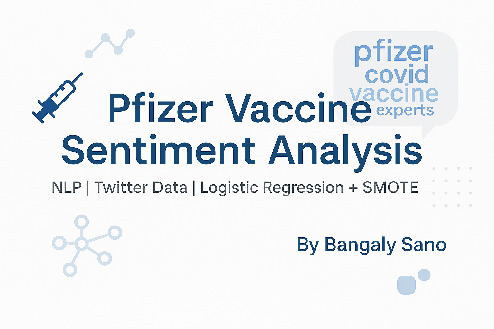
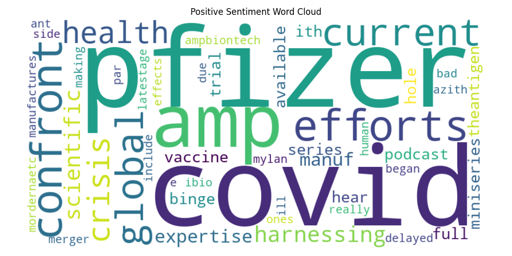
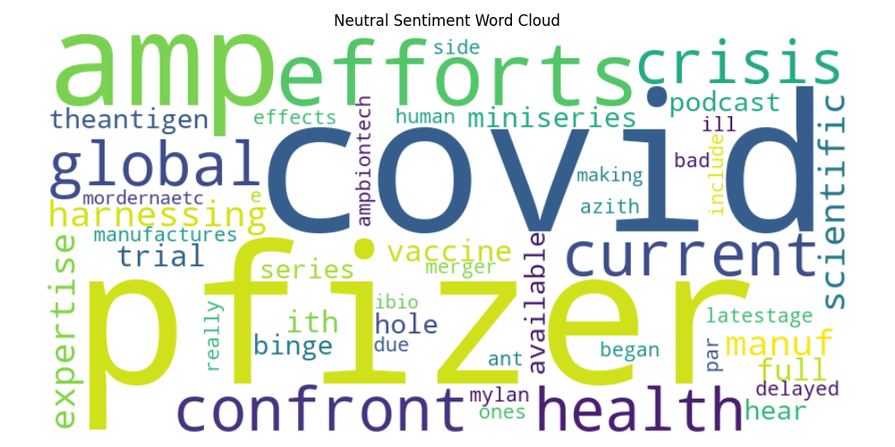
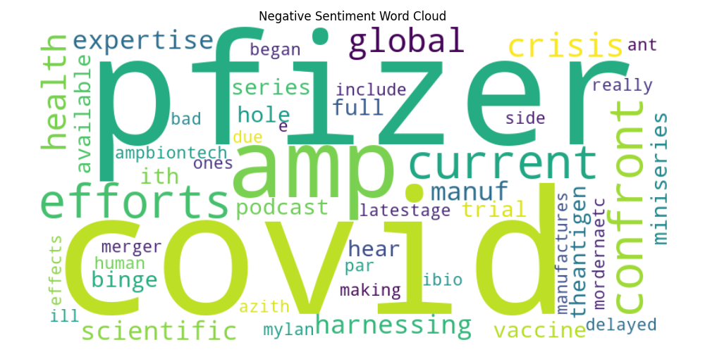

# 💉 Pfizer Vaccine Sentiment Analysis

This project explores public sentiment toward the Pfizer COVID-19 vaccine using Natural Language Processing (NLP) and machine learning.

We analyzed real-world X formerly (Twitter) data, performed text preprocessing, visualized word clouds by sentiment class, and trained a classifier using Logistic Regression.  
To address class imbalance (fewer negative tweets), we applied **SMOTE (Synthetic Minority Oversampling Technique)** to balance the dataset before training.

---

## 🧾 Dataset

- **Source:** [Kaggle - COVID-19 Vaccine Tweets Dataset](https://www.kaggle.com/gpreda/covid19-tweets)
- **Format:** CSV with tweet text, user metadata, and date
- **Size Used:** 73 labeled tweets (manually sentiment-tagged using VADER)

---

## 🔍 Project Workflow

1. **Data Cleaning**  
   Removed URLs, mentions, special characters. Applied tokenization, stopword removal, and lemmatization.

2. **Sentiment Labeling**  
   Used VADER Sentiment Analyzer to tag tweets as Positive, Neutral, or Negative.

3. **Visualization**  
   Created word clouds per sentiment to explore recurring language themes.

4. **Feature Extraction**  
   TF-IDF vectorization on the cleaned tweet text.

5. **Modeling**  
   Trained a **Logistic Regression** classifier to predict sentiment.

6. **Handling Class Imbalance**  
   The dataset had far fewer negative sentiment samples.  
   We used **SMOTE (Synthetic Minority Oversampling Technique)** to generate synthetic examples for the minority class, resulting in a more balanced training set and improved performance.

7. **Evaluation**  
   - Accuracy after SMOTE: **75%**
   - F1-score for Negative class: **1.00**
   - Macro-average F1-score: **0.78**

---

## 📊 Results

**Classification Report (after SMOTE):**

| Sentiment | Precision | Recall | F1-score |
|-----------|-----------|--------|----------|
| Negative  | 1.00      | 1.00   | 1.00     |
| Neutral   | 0.58      | 0.88   | 0.70     |
| Positive  | 0.83      | 0.50   | 0.62     |

- **Overall Accuracy:** 75%  
- **Macro Avg F1-score:** 0.78  
- Balanced performance across all sentiment types

---

## 🖼️ Visualizations

Word Clouds per Sentiment:

  
  


---

## 🧰 Tech Stack

- Python
- Pandas, NumPy, Matplotlib, Seaborn
- NLTK
- Scikit-learn
- Imbalanced-learn (SMOTE)
- WordCloud
- VADER Sentiment Analyzer
- Jupyter Notebook

---

## ▶️ How to Run

1. Clone this repo:
   ```bash
   git clone https://github.com/your-username/pfizer-vaccine-sentiment-analysis.git

---

📌 Author
Bangaly Sano
GitHub • LinkedIn
